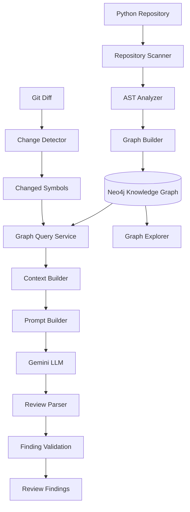
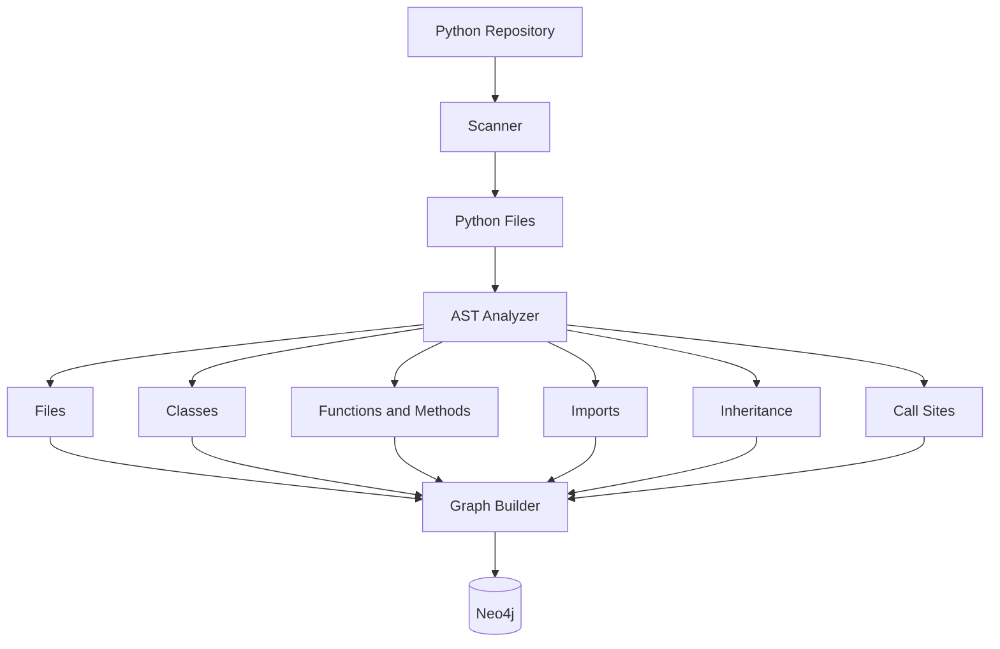
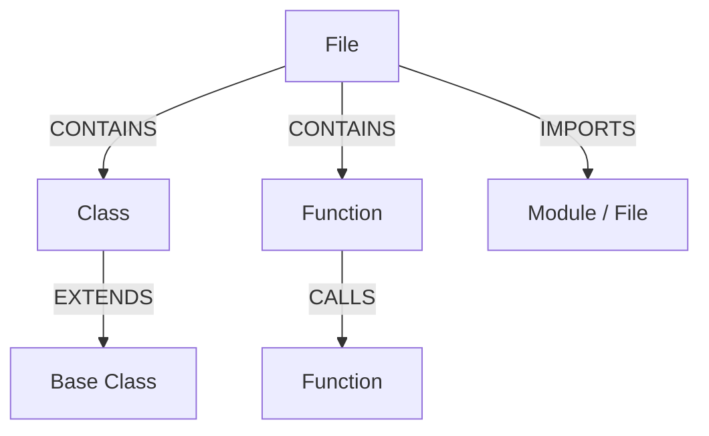
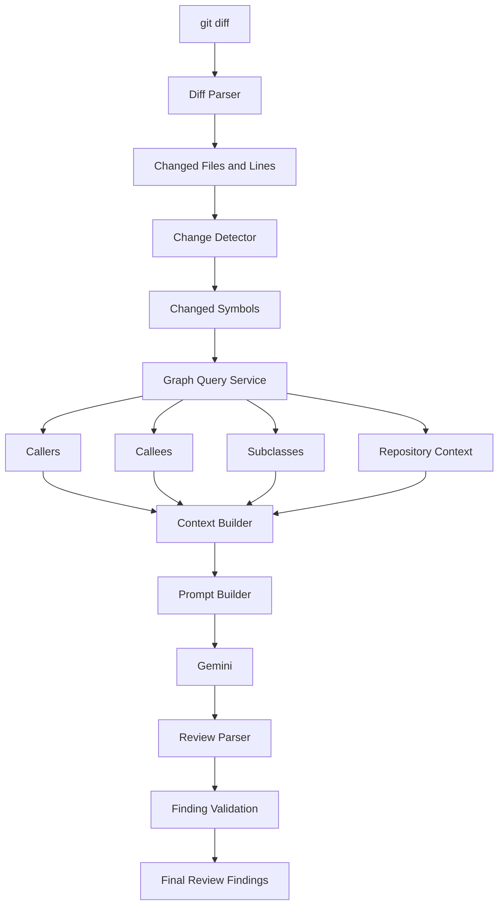
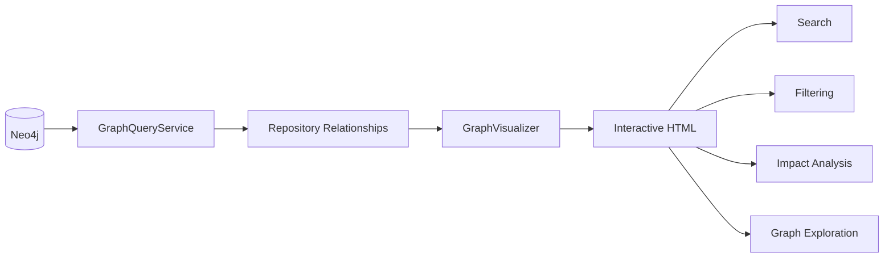
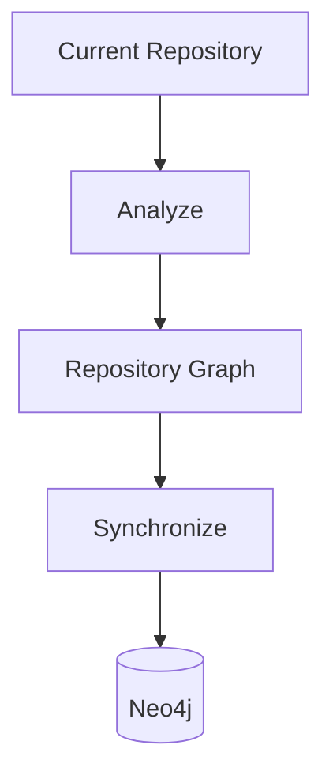
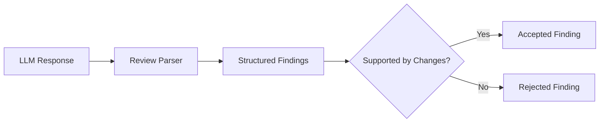
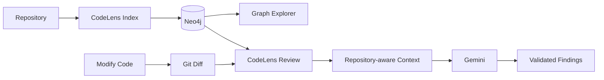

# CodeLens

LLM-powered, repository-aware code review using a Python knowledge graph and Neo4j.

## Demo

https://github.com/user-attachments/assets/b057784f-07b9-450b-8112-25e7d7feda5f

The `[HIGH]` finding in LIVE VIDEO ABOVE demonstrates CodeLens detecting a correctness issue in the changed code and grounding the review in the repository's structure and relationships.

## Architecture

...


# CodeLens

### Repository-aware AI code review powered by a Python knowledge graph

CodeLens is an LLM-powered code review assistant that analyzes Python repositories, builds a structural knowledge graph in Neo4j, and uses repository context when reviewing Git changes.

Instead of reviewing a changed diff in isolation, CodeLens can use information about the surrounding code structure — including symbols, files, imports, inheritance, and statically recognizable function calls — to provide repository-aware review context.

---

## Why CodeLens?

A basic LLM review workflow looks like:

```text
Git diff
   ↓
LLM
   ↓
Review findings
```

CodeLens adds a repository knowledge layer:

```text
Git diff
   ↓
Changed symbols
   ↓
Repository graph lookup
   ↓
Verified structural context
   ↓
LLM
   ↓
Validated review findings
```

The goal is not to replace the LLM.

The goal is to give the LLM better evidence about the repository.

---

# Architecture



### Core separation

- **Analysis** determines what exists in the repository.
- **Graph construction** stores repository structure.
- **Graph queries** retrieve structural context.
- **Change detection** determines what changed.
- **Context building** connects changed code to repository knowledge.
- **LLM review** reasons over the supplied context.
- **Validation** checks findings against the detected changes.
- **Graph Explorer** provides a visual interface for understanding the repository.

---

# Repository Indexing

The `index` command analyzes the repository and synchronizes its structural representation into Neo4j.



The analyzer uses Python's AST rather than asking an LLM to infer basic repository structure.

That gives CodeLens deterministic information about the source code.

---

# Knowledge Graph

The repository is represented as typed entities and relationships.

## Main entities

```text
File
Class
Function
Method
Module
```

## Main relationships

```text
CONTAINS
CALLS
EXTENDS
IMPORTS
```

Conceptually:



Relationships are repository-scoped so symbols from different repositories do not accidentally collide.

---

# Review Workflow

The `review` command analyzes the current Git working-tree diff.



The key design principle is:

> **The LLM receives repository context that CodeLens can establish from the indexed graph.**

This reduces the amount of repository structure the model has to infer on its own.

---

# Example

Suppose a change modifies:

```python
def process_payment(data):
    ...
```

CodeLens can identify the changed symbol and query the repository graph for related structure.

Conceptually:

```text
process_payment
      │
      ├── CALLERS
      │     ├── checkout()
      │     └── retry_payment()
      │
      ├── CALLEES
      │     ├── validate_payment()
      │     └── save_transaction()
      │
      └── inheritance / structural context
```

The review context is therefore not only:

```text
"Here is the changed code."
```

It can instead contain:

```text
"Here is the changed code and relevant repository
structure established from the graph."
```

---

# Interactive Graph Explorer

CodeLens includes an interactive browser-based graph explorer.

Generate it with:

```bash
.venv/bin/codelens graph
```

The command generates:

```text
codelens-graph.html
```

The Graph Explorer currently provides:

- Interactive repository graph
- Dark visualization interface
- Typed node colors
- Typed relationship colors
- Repository statistics
- Node-type filtering
- Relationship filtering
- Symbol search
- Symbol focus
- Impact inspection
- Caller/callee exploration
- Inheritance context
- Top repository hubs
- Expandable/collapsible Insights panel

### Graph Explorer flow



### Planned demo media

A screenshot/GIF and a short GitHub demonstration video will be added during the final presentation phase.

```text
[ Graph Explorer screenshot ]

[ Demo video ]
```

---

# Installation

## Requirements

CodeLens currently requires:

- Python 3.13+
- Neo4j
- Google Gemini API access

Create a virtual environment:

```bash
python -m venv .venv
```

Activate it on macOS/Linux:

```bash
source .venv/bin/activate
```

Install CodeLens:

```bash
pip install -e .
```

Runtime dependencies are declared in `pyproject.toml`.

---

# Neo4j

CodeLens uses Neo4j as its repository knowledge graph.

The current implementation uses the `neo4j` database by default.

The Neo4j client is isolated from the higher-level review workflow so graph access remains a separate infrastructure concern.

---

# Gemini

CodeLens uses Google's Gemini API for LLM-based review generation.

Configure the Gemini API credentials required by the provider before running reviews.

The LLM layer is isolated behind a provider abstraction so the review workflow does not directly depend on a specific model implementation.

---

# Usage

## Show help

```bash
.venv/bin/codelens --help
```

The CLI provides:

```text
index
review
graph
```

## Index a repository

Run from the repository root:

```bash
.venv/bin/codelens index
```

Expected output:

```text
Repository indexed.
```

This analyzes the repository and synchronizes its structural representation into Neo4j.

## Review current changes

Make changes to the repository and run:

```bash
.venv/bin/codelens review
```

CodeLens obtains the current Git diff and runs the repository-aware review workflow.

If there are no changes:

```text
No changes to review.
```

If there are no validated findings:

```text
No review findings.
```

Otherwise findings are displayed with severity, title, location, and description.

Example:

```text
[HIGH] SQL injection
service.py:10-12
User input is passed directly to a query.
```

## Explore the repository graph

First index the repository:

```bash
.venv/bin/codelens index
```

Then generate the graph:

```bash
.venv/bin/codelens graph
```

Open the generated HTML file in a browser.

---

# Project Structure

```text
codelens/
├── examples/
│   └── review_target.py
│
├── src/
│   └── codelens/
│       ├── analyzer.py
│       ├── change_detector.py
│       ├── cli.py
│       ├── context_builder.py
│       ├── diff_parser.py
│       ├── gemini_provider.py
│       ├── graph_builder.py
│       ├── graph_queries.py
│       ├── graph_visualizer.py
│       ├── llm_provider.py
│       ├── neo4j_client.py
│       ├── prompt_builder.py
│       ├── review_parser.py
│       ├── review.py
│       ├── review_workflow.py
│       ├── scanner.py
│       └── source_provider.py
│
├── tests/
│   ├── test_analyzer.py
│   ├── test_change_detector.py
│   ├── test_cli.py
│   ├── test_context_builder.py
│   ├── test_diff_parser.py
│   ├── test_gemini_provider.py
│   ├── test_graph_builder.py
│   ├── test_graph_queries.py
│   ├── test_graph_visualizer.py
│   ├── test_llm_provider.py
│   ├── test_neo4j_client.py
│   ├── test_prompt_builder.py
│   ├── test_review_parser.py
│   ├── test_review_workflow.py
│   ├── test_review.py
│   ├── test_scanner.py
│   └── test_source_provider.py
│
├── pyproject.toml
└── README.md
```

---

# Core Components

| Component | Responsibility |
|---|---|
| `scanner.py` | Discover Python source files |
| `analyzer.py` | Extract repository structure and relationships |
| `graph_builder.py` | Ingest repository structure into Neo4j |
| `graph_queries.py` | Query repository relationships and context |
| `change_detector.py` | Determine changed symbols |
| `diff_parser.py` | Parse Git diffs |
| `context_builder.py` | Build repository-aware review context |
| `prompt_builder.py` | Construct LLM prompts |
| `gemini_provider.py` | Gemini implementation |
| `review_parser.py` | Parse structured model output |
| `review_workflow.py` | Coordinate the review pipeline |
| `graph_visualizer.py` | Generate the interactive graph |
| `cli.py` | Command-line interface |

---

# Engineering Design

CodeLens deliberately separates deterministic program analysis from probabilistic LLM reasoning.

```text
                 DETERMINISTIC
                      │
                      ▼
        ┌─────────────────────────┐
        │ Repository structure    │
        │ AST analysis            │
        │ Git diff                │
        │ Graph queries           │
        │ Finding validation      │
        └────────────┬────────────┘
                     │
                     ▼
                  Context
                     │
                     ▼
        ┌─────────────────────────┐
        │         Gemini          │
        │   Probabilistic         │
        │   reasoning layer       │
        └─────────────────────────┘
```

The system should not ask the LLM to invent repository facts that can instead be obtained from the source code and graph.

---

# Repository Synchronization

Indexing is designed to synchronize the graph with the current repository state rather than blindly accumulating stale symbols.



This matters because stale graph state can produce misleading review context.

---

# Review Finding Validation

LLM output is not treated as automatically trustworthy.

The review pipeline validates findings against the detected changes.



This is an important distinction between CodeLens and a simple "send the diff to an LLM" implementation.

---

# Testing

Run the complete test suite with:

```bash
.venv/bin/python -m pytest -q
```

The current repository has **100+ passing tests** covering major components including:

- AST analysis
- repository scanning
- change detection
- diff parsing
- graph construction
- graph queries
- graph visualization
- Neo4j client behavior
- LLM provider behavior
- prompt construction
- review parsing
- finding validation
- review workflow
- CLI behavior

The exact count may change as the project evolves.

---

# Current Capabilities

## Repository analysis

- Python AST analysis
- File discovery
- Class extraction
- Function extraction
- Method extraction
- Import extraction
- Inheritance extraction
- Statically recognizable call extraction

## Knowledge graph

- Repository-scoped entities
- `CONTAINS`
- `CALLS`
- `EXTENDS`
- `IMPORTS`
- Graph synchronization
- Relationship queries
- Caller lookup
- Callee lookup
- Subclass lookup
- Impact context

## AI review

- Git diff analysis
- Changed-symbol detection
- Repository-aware context
- Structured prompts
- Gemini integration
- Structured review findings
- Finding validation

## Graph Explorer

- Interactive graph
- Search
- Focus
- Node-type filtering
- Relationship filtering
- Insights
- Impact inspection
- Caller/callee exploration
- Inheritance exploration

---

# Current Limitations

CodeLens is not presented as a complete static-analysis engine.

Current limitations include:

- Call resolution is limited to statically recognizable call patterns.
- Dynamic Python behavior cannot always be resolved statically.
- The graph does not represent every possible runtime relationship.
- The system currently focuses on Python repositories.
- LLM findings still depend on the quality of supplied context and model reasoning.
- Neo4j is required for the graph-backed workflow.
- The Graph Explorer is currently generated as a standalone HTML artifact.

These limitations are part of the current engineering scope.

---

# Roadmap

## Completed

- [x] Repository scanner
- [x] Python AST analyzer
- [x] Repository graph construction
- [x] Neo4j integration
- [x] Import relationships
- [x] Inheritance relationships
- [x] Call relationships
- [x] Repository synchronization
- [x] Git diff analysis
- [x] Changed-symbol detection
- [x] Repository-aware review context
- [x] Gemini integration
- [x] Review finding validation
- [x] CLI workflow
- [x] Graph relationship API
- [x] Interactive Graph Explorer
- [x] Graph search and filtering
- [x] Graph impact inspection

## Next

- [ ] Public demo repository
- [ ] GitHub demo video
- [ ] Final documentation polish
- [ ] Screenshots / GIF demonstrations
- [ ] Final release preparation

Future extensions may include deeper static analysis, broader call resolution, additional languages, and richer review-to-graph navigation.

---

# Demo

The final demonstration will show the complete CodeLens workflow:



### Planned GitHub demonstration

The demo will show:

1. Indexing a repository.
2. Exploring its knowledge graph.
3. Making a code change.
4. Running `codelens review`.
5. Showing how repository context reaches the review.
6. Showing the resulting validated finding.

A recorded demo video and final screenshots will be added before the public release.

---

# Tech Stack

| Area | Technology |
|---|---|
| Language | Python |
| AST analysis | Python `ast` |
| Graph database | Neo4j |
| LLM | Google Gemini |
| Graph visualization | PyVis |
| CLI | `argparse` |
| Testing | pytest |
| Packaging | setuptools / `pyproject.toml` |

---

# Engineering Philosophy

CodeLens follows one central principle:

> **Use deterministic program analysis to establish repository facts, then use an LLM to reason over those facts.**

The knowledge graph is not just a visualization feature.

It provides a structured representation of repository relationships that are difficult to communicate through a raw Git diff alone.

The LLM is therefore used where it is strongest — reasoning about code and identifying potential issues — while repository structure is established by deterministic tooling wherever possible.

---

# Status

**CodeLens v0.1.1**

The current version represents a functional repository-aware code review system with:

- Python repository analysis
- Neo4j knowledge graph
- Relationship extraction
- Change-aware review context
- Gemini-powered review
- Validated findings
- Interactive graph exploration

The project is now moving from core engineering into documentation, demonstration, and release polish.

---

# License

License information will be added before the public release.
